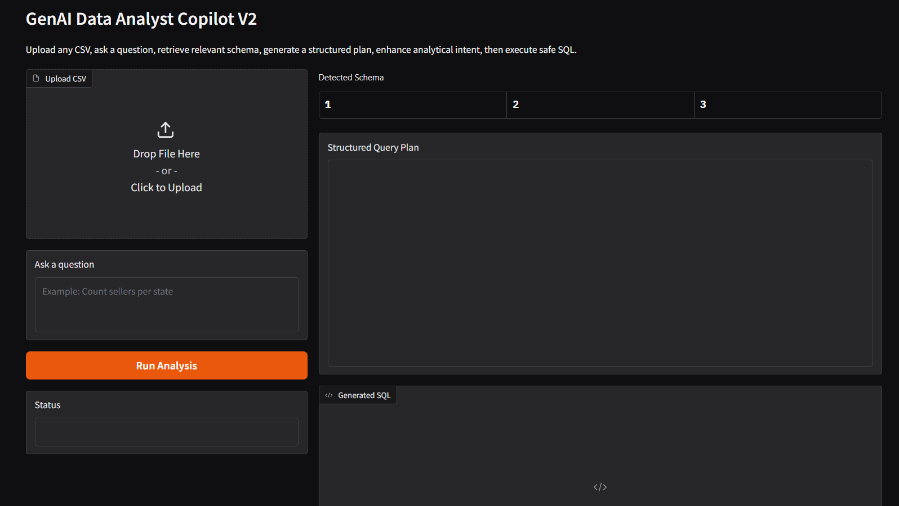
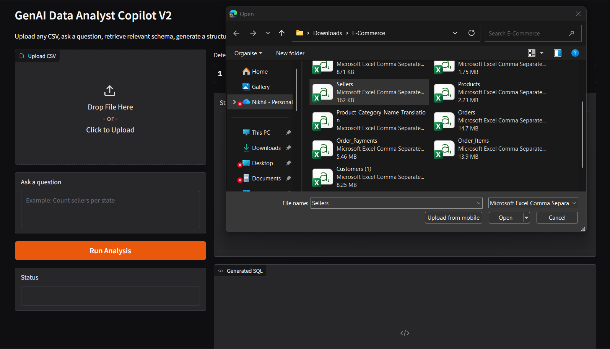
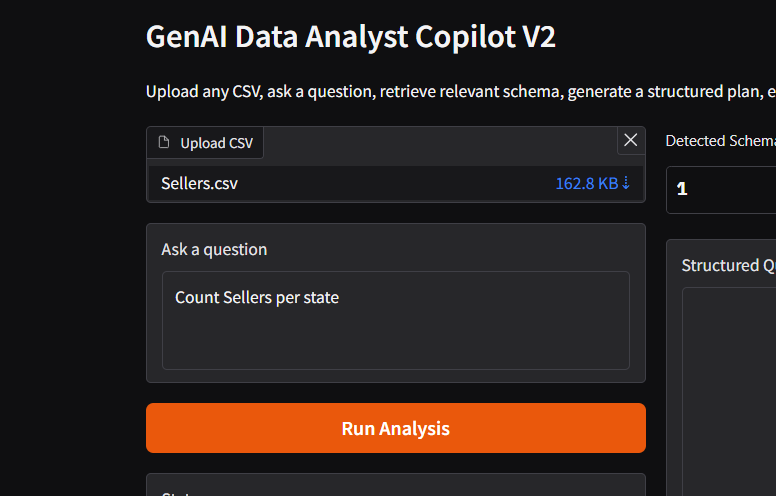
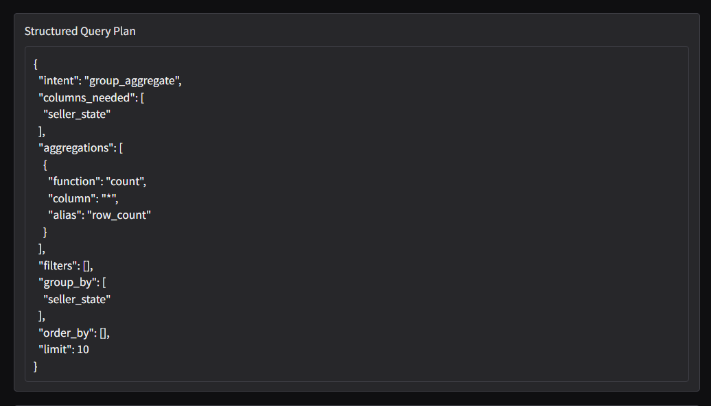
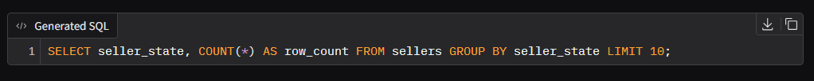
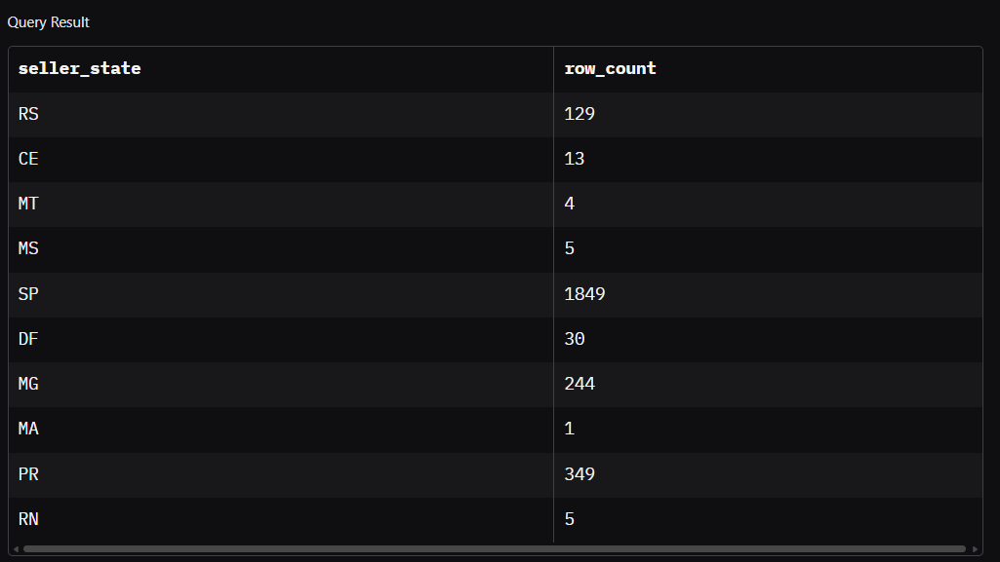
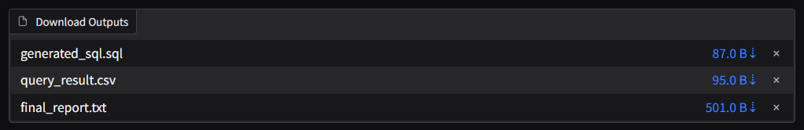

# Note: Live Link 

# GenAI Data Analytics Copilot

GenAI-powered assistant that converts natural language questions into SQL queries and performs automated analytics on uploaded datasets.

The system allows users to explore data without writing SQL by simply asking questions in natural language. It automatically understands the dataset schema, generates analytical query plans using a language model, builds safe SQL queries, executes them, and returns structured insights.

---

# Project Overview

Traditional data analysis requires writing SQL queries and manually exploring datasets.

This project introduces a **GenAI Data Analytics Copilot** that enables:

• Natural language analytics
• Automatic SQL generation
• Instant query execution
• Downloadable analysis outputs

The application is designed as an **AI-powered self-service analytics system**.

---

# Application Interface

Users upload a dataset and ask questions directly.



---

# Dataset Upload

The system accepts CSV datasets for analysis.



---

# Asking Analytical Questions

Users ask analytical questions in natural language.

Example:

```
Count sellers per state
```



---

# Structured Query Plan (GenAI Step)

The LLM converts the natural language question into a structured analytical plan.



Example generated plan:

```json
{
 "intent": "group_aggregate",
 "columns_needed": ["seller_state"],
 "aggregations": [
   {
     "function": "count",
     "column": "*",
     "alias": "row_count"
   }
 ],
 "group_by": ["seller_state"],
 "limit": 10
}
```

This step is where **Generative AI is used** to interpret user intent.

---

# Generated SQL Query

The system converts the structured plan into a safe SQL query.



Example SQL:

```sql
SELECT seller_state,
       COUNT(*) AS row_count
FROM sellers
GROUP BY seller_state
LIMIT 10;
```

---

# Query Results

The generated SQL is executed using DuckDB and the results are displayed instantly.



Example output:

| seller_state | row_count |
| ------------ | --------- |
| SP           | 1849      |
| PR           | 349       |
| MG           | 244       |
| SC           | 190       |

---

# Downloadable Analytics Outputs

Users can download the analysis results.



Generated files include:

* generated_sql.sql
* query_result.csv
* final_report.txt

---

# System Architecture

```
User Question
      │
      ▼
Schema Detection
      │
      ▼
Embedding-based Schema Retrieval
      │
      ▼
LLM Query Planner (GenAI)
      │
      ▼
Intent Enhancer
      │
      ▼
SQL Builder
      │
      ▼
DuckDB Query Engine
      │
      ▼
Results + Reports
```

---

# Technologies Used

Python
LangChain
Transformers
Sentence Transformers
DuckDB
Pandas
Gradio

---

# Key Features

• Natural Language Data Analysis
• Automatic schema detection
• LLM-based query planning
• Safe SQL generation
• Fast query execution with DuckDB
• Downloadable analysis outputs

---

# Example Analytical Queries

The system supports multiple analytical queries:

```
Count sellers per state
Which states have highest sellers
Top seller cities
Average review score
Total number of orders
```

---

# Installation

Create virtual environment

```
python -m venv venv
```

Activate environment

```
venv\Scripts\activate
```

Install dependencies

```
pip install -r requirements.txt
```

Run application

```
python app.py
```

Open browser

```
http://127.0.0.1:7860
```

---

# Real-World Applications

This system can be used for:

• Business analytics dashboards
• Self-service data analytics platforms
• Internal company AI copilots
• Customer analytics systems
• Automated SQL analytics assistants

---

# Future Improvements

• Multi-table dataset analysis
• Automatic visualizations
• Excel and PDF dataset support
• Cloud deployment
• API integration
